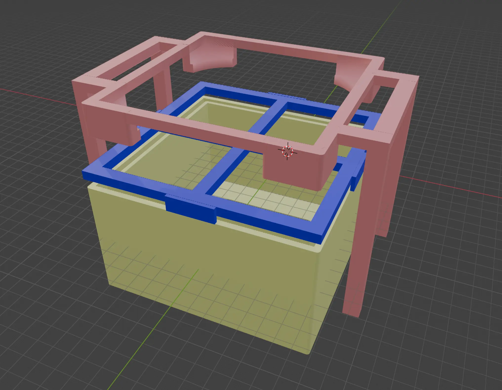
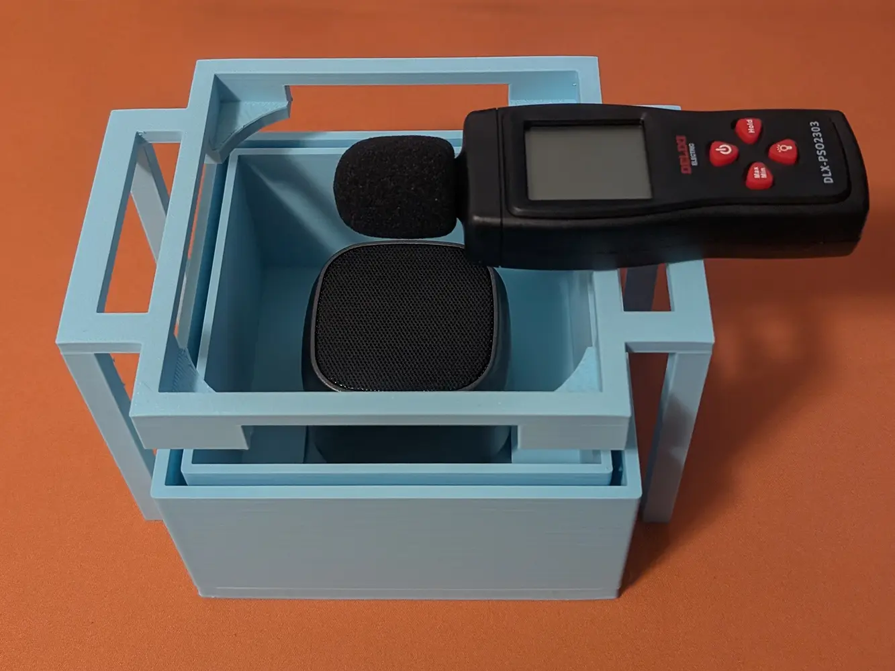
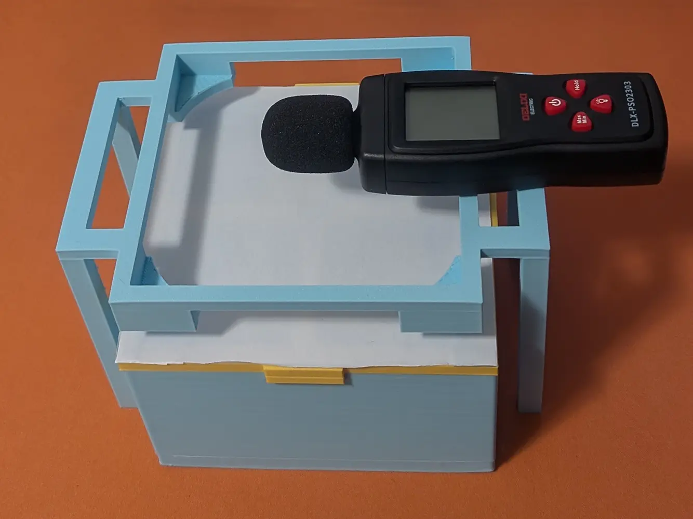
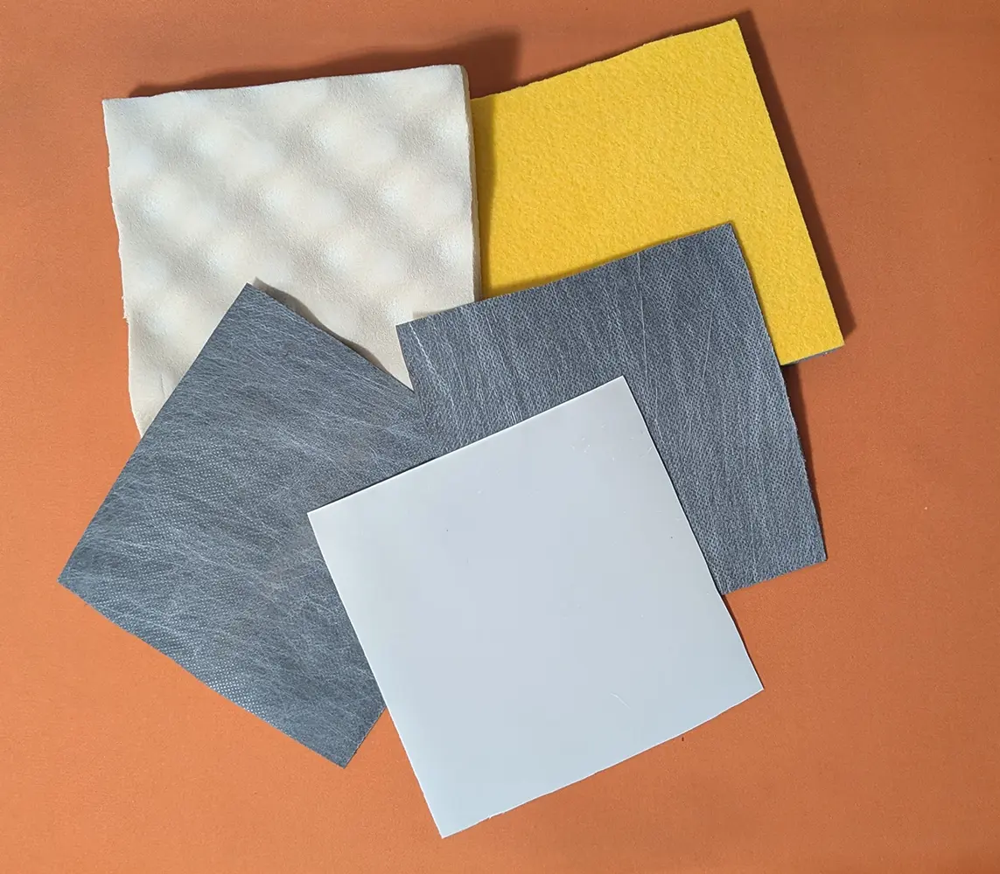

# 隔音测试盒

这几天我想要改装1下卧室的隔音，所以就想着，去网购1些隔音材料贴在我的门和窗户上吧。

但有1个问题，我怎么知道隔音材料是真的隔音，而不是商家搞1些没用的东西来骗我的钱？

所以我就买了分贝计、蓝牙音响和6种不同的隔音材料，来测试1下到底哪1种的效果是最好的！

## 准备

首先我们得有1个固定的测试环境，如果测试的距离或者材料大小1直变，结果就不准了，所以我画了这样1个模型:

它是由3个部分组成的:

- 下面的箱子用来放蓝牙音响。
- 中间的那个框框是盖子，把隔音材料放在上面。
- 上面的架子用来放分贝计。

箱子设计了2层壁，这样可以阻止蓝牙音响的声音从侧面漏出来，按理说漏出来其实也没关系，因为我们要测的是相对值，不过如果漏的太多，结果的误差就变大了！

架子和下面的箱子是没有连接的，防止固体传声，所以最后需要目测对齐1下。

打印出来之后是这样:

把盖子盖上是这样:

你们可能会想为什么这个架子的形状要这样设计，其实它之前是个12cm风扇架，正好能用就不改它了。

此外， 我还准备了2个发音代码，是`发音-白.py`和`发音-粉红.py`，用来播放标准的噪声。

虽然是Gemini帮我写的，不过用耳朵验证应该是没有问题。

## 测试

好，接下来请我们的参赛选手出场，我把它们都裁剪成了和测试盒的盖子1样的大小:

接下来，我们在系统音量30%下，使用前面准备的代码，向蓝牙音响分别播放白噪声和粉红噪声。

然后我就盯着分贝计的读数，不过因为读数常常抖动，因此取最低值作为当前选手的分数。

测试下来各个选手的隔音性能，结果是这样:

| 材料 | 厚度 | 白噪声 | 粉红噪声 |
|:--|--|--|--:|
| 打印纸 | 太薄了测不出来 | 62.5dB | 60.3dB |
| 隔音棉 | 2cm | 52.7dB | 51.9dB |
| 隔音棉-波浪形态 | 2cm | 58.6dB | 55.0dB |
| 隔音毡 | 1.2mm | 47.4dB | 47.1dB |
| 隔音毡 | 2mm | 45.2dB | 43.7dB |
| 出口级欧标隔音毡 | 1.2mm | 47.3dB | 46.0dB |

实验的空白组用的是打印纸而不是什么都不放，这是因为感觉空气的连通性也会影响结果。

看来最好的还是2mm的隔音毡，此外还有1些其他的结论:

- 隔音棉没有什么用。
- 几款隔音毡的效果都挺好。
- 2mm的款式比1.2mm厚了2/3，但隔音效果并没有好太多。
- 欧标会略微加强隔音效果，但不显著。

## 链接

为了可复现，这里贴1下各个商品的链接。

不过隔音材料我就放赢的商家，那3款隔音毡是同1家的，不然等下输的商家非常生气然后要派人来暗杀我！

- 分贝计: https://item.jd.com/100063833236.html
- 蓝牙音响: https://item.jd.com/100015842987.html
- 隔音毡: https://item.taobao.com/item.htm?id=838537701197

## 结束

就这样，大家88，我要给窗户粘隔音毡了！
